<h2 align="center">7ac9d42</h2>

  “没有什么比‘感兴趣’更值得为之付出精力的了。”

  <a href="https://home.kuapt.top/">HomePage</a> • 
  <a href="https://blog.kuapt.top/">Blog</a> • 
  <a href="mailto:7ac9d42@kuapt.top">Email</a> • 
  <a href="https://t.me/PM_7ac9d42_bot">Telegram</a>

<table width="100%" align="center">
  <tr>
    <td align="center" width="50%">
      <picture>
        <source
          media="(prefers-color-scheme: dark)"
          srcset="./profile/stats-dark.svg" />
        
      </picture>
    </td>
    <td align="center" width="50%">
      <picture>
        <source
          media="(prefers-color-scheme: dark)"
          srcset="./profile/top-langs-dark.svg" />
        
      </picture>
    </td>
  </tr>
</table>

### How I Build

认同并尽可能接近以下准则：

- **保持简单 (KISS & YAGNI)**：清晰、直观且易维护优先，拒绝过度抽象与模式堆砌
- **最小必要与精准定位**：以解决实际问题为唯一导向，改动克制，减少冗余重构与非必要依赖
- **闭环与确定性**：追求逻辑自洽，低耦合高内聚，保持代码与运行环境的整洁
